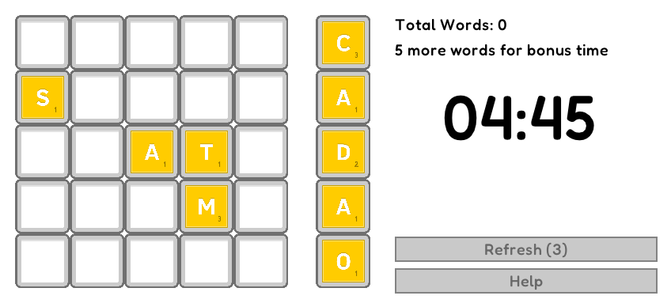

# Wordgrid 

## Description



Wordgrid is a puzzle game, the goal of the game is to survive as long as possible. You 
Form words by dragging tiles from the line of tiles into the grid, when a row or a column is filled the word 
is removed and you get a score. Words can be made from left to right or from top to bottom. 
There are three special tiles, you can activate them by dragging them onto the board 'x' will
remove one tile, '|' will remove a whole column and '-' will remove a row. 

There are two game modes, Time Attack and Move Attack, in Time Attack your play time is limited but can be extended 
by making words, in Move Attack your number of moves is limited but you can get more by making words.

By clicking `Refresh` you can swap out the list of letters that is available to you but you can only do 
that as many times as indicated in the button

Have Fun and Good Luck!

## Building

Chose one of the follow setup, that fit in you development enviroment. Wordgrid uses the small game 
development library [raylib](https://github.com/raysan5/raylib), [raygui](https://github.com/raysan5/raygui) 
and is based on the [raylib-game-template](https://github.com/raysan5/raylib-game-template)

### Visual Studio

- After extracting the zip, the parent folder `raylib-game-template` should exist in the same directory as `raylib` itself.  So your file structure should look like this:
    - Some parent directory
        - `raylib`
            - the contents of https://github.com/raysan5/raylib
        - `raylib-game-template`
            - this `README.md` and all other raylib-game-template files
- If using Visual Studio, open projects/VS2022/raylib-game-template.sln
- Select on `raylib_game` in the solution explorer, then in the toolbar at the top, click `Project` > `Set as Startup Project`
- Now you're all set up!  Click `Local Windows Debugger` with the green play arrow and the project will run.

### CMake

- Extract the zip of this project
- Type the follow command:

```sh
cmake -S . -B build
```

> if you want with debug symbols put the flag `-DCMAKE_BUILD_TYPE=Debug`

- After CMake config you project build:

```sh
cmake --build build
```

- Inside the build folder are another folder (named the same as the project name on CMakeLists.txt) with the executable and resources folder.

### License

This game sources are licensed under an unmodified zlib/libpng license, which is an OSI-certified, BSD-like license that allows static linking with closed source software. Check [LICENSE](LICENSE) for further details.

*Copyright (c)2024 Harald Scheirich*
